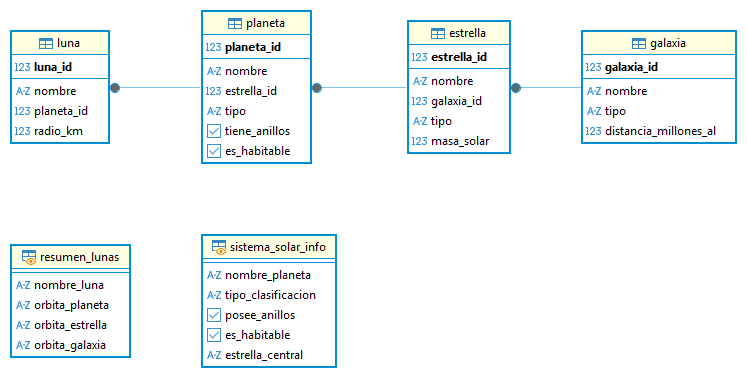
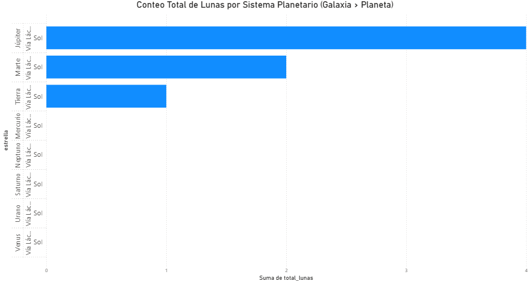
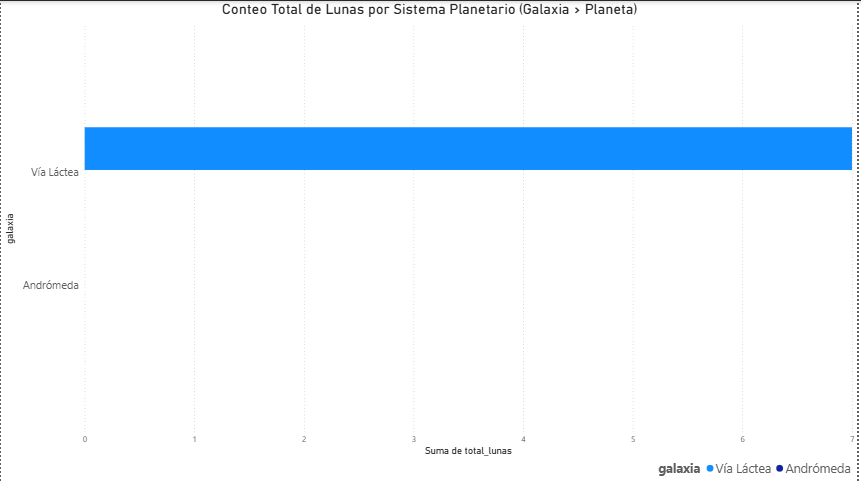
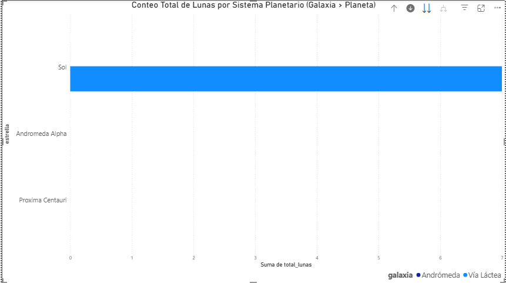
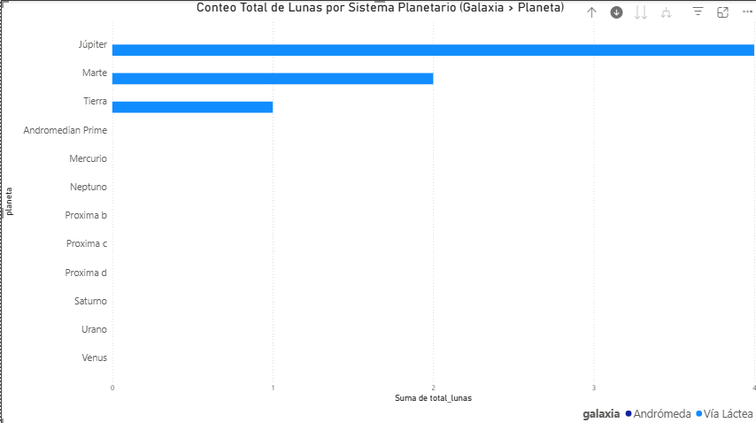
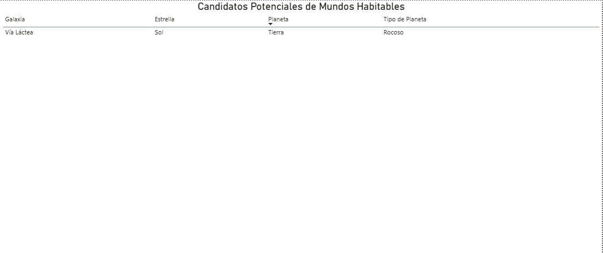
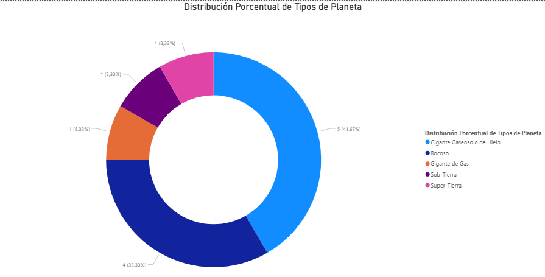

# Proyecto N°1: Modelado de Base de Datos - Cuerpos Celestes

## 1. Objetivo y Resumen Ejecutivo

Este proyecto tiene como objetivo diseñar y modelar una base de datos relacional para gestionar información jerárquica de galaxias, estrellas, planetas y lunas.

**Resumen:** Se implementó un esquema relacional normalizado, se cargaron datos (DDL/DML) y se realizaron consultas analíticas que fueron visualizadas en un dashboard interactivo de Business Intelligence (Power BI) para obtener el ranking de lunas por planeta, los candidatos potenciales de mundos habitables, y la distribución porcentual de tipos de planeta.

---

## 2. Tecnologías y Herramientas Utilizadas

| Categoría | Herramienta | Uso Específico |
| :--- | :--- | :--- |
| **Base de Datos** | PostgreSQL | Almacenamiento y ejecución de SQL. |
| **Modelado** | DBeaver | Diseño del Diagrama Entidad-Relación (ERD). |
| **Análisis** | SQL (JOINs, GROUP BY, COUNT) | Desarrollo de las Consultas Analíticas Clave. |
| **Visualización** | Power BI | Creación del Dashboard de Conteo de Lunas, Mundos Habitables y Tipos de Planeta. |

---

## 3. Resultados Clave y Visualizaciones

### A. Diseño del Modelo de Datos (ERD)

El esquema utiliza un modelo relacional con jerarquía 1:N que conecta Galaxia -> Estrella -> Planeta -> Luna.

### B. Análisis de Business Intelligence (Power BI Dashboard)

El dashboard consolida tres visualizaciones clave basadas en consultas analíticas de la base de datos:

#### **Gráfico 1: Ranking de Conteo de Lunas**
* **Enfoque:** Jerarquía y Agregación. Determina el planeta con el mayor número de lunas, demostrando la capacidad de consolidar información a través de las cuatro tablas (`JOINs`, `COUNT`, `GROUP BY`).
* **Visualización:** Gráfico de barras interactivo.
    
> **Nota:** El gráfico es interactivo y permite la navegación jerárquica (Drill Down). Se han incluido 3 vistas para demostrar la interactividad:
> 1.  
> 2.  
> 3.  
#### **Gráfico 2: Reporte de Mundos Habitables**
* **Enfoque:** Filtrado Lógico. Muestra la tabla de planetas que cumplen con el criterio `es_habitable = TRUE`. Demuestra la habilidad para extraer un reporte de estado clave para el negocio (el análisis de datos).
* **Visualización:** Matriz o Tabla.
    

#### **Gráfico 3: Distribución de Tipos de Planeta**
* **Enfoque:** Distribución Categórica. Muestra la proporción de los diferentes tipos de planetas (Gigante de Gas, Súper-Tierra, etc.). Demuestra la habilidad para generar una métrica de composición a partir de una columna categórica.
* **Visualización:** Gráfico de Anillo (*Donut* o Pastel).
    

---

## 4. Procedimiento y Fases del Proyecto

1.  **Fase 1: Modelado y DDL/DML:** Creación del esquema con cuatro tablas (`Galaxia`, `Estrella`, `Planeta`, `Luna`) y definición de claves primarias y foráneas para asegurar la integridad referencial. Se utilizó el script principal para la carga de datos.
2.  **Fase 2: Consultas Analíticas (SQL):** Desarrollo de las consultas clave para responder a los requerimientos de negocio, incluyendo:
    * **Análisis Jerárquico:** Uso de `JOINs`, `COUNT` y `GROUP BY` para obtener el ranking de lunas por planeta.
    * **Filtrado Lógico:** Uso de la cláusula `WHERE` para identificar planetas habitables (`es_habitable = TRUE`).
    * **Análisis de Distribución:** Uso de `GROUP BY` para resumir la composición de la base de datos por tipo de planeta.
3.  **Fase 3: Análisis de BI:** Conexión de Power BI a la base de datos para la generación del Dashboard que visualiza las tres consultas analíticas en un único informe.

---

## 5. Estructura del Repositorio y Archivos

* **`Proyecto N°1 - Base de Datos de Cuerpos Celestes.sql`**: Contiene la sentencia `CREATE DATABASE`, el DDL (tablas) y el DML (inserción de datos).
* **`Consultas_Clave_Proyecto1.sql`**: Contiene las consultas analíticas clave.
* **`README.md`**: Documentación del proyecto.
* **`assets/`**: Carpeta que contiene todas las imágenes (ERD y gráficos de Power BI).

---

## 6. Conclusiones

La base de datos relacional modelada permite un almacenamiento eficiente y jerárquico de la información astronómica. El análisis de las consultas valida el modelo, demostrando que es posible obtener métricas de valor (ej. el conteo de lunas por planeta) cruciales para cualquier proyecto científico de datos.