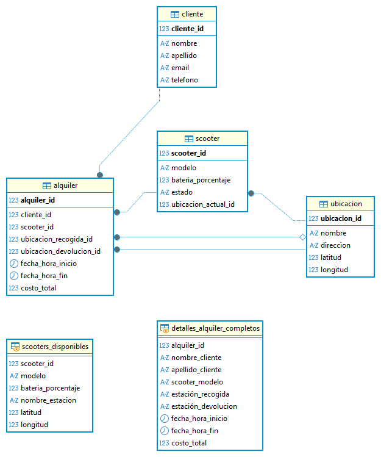
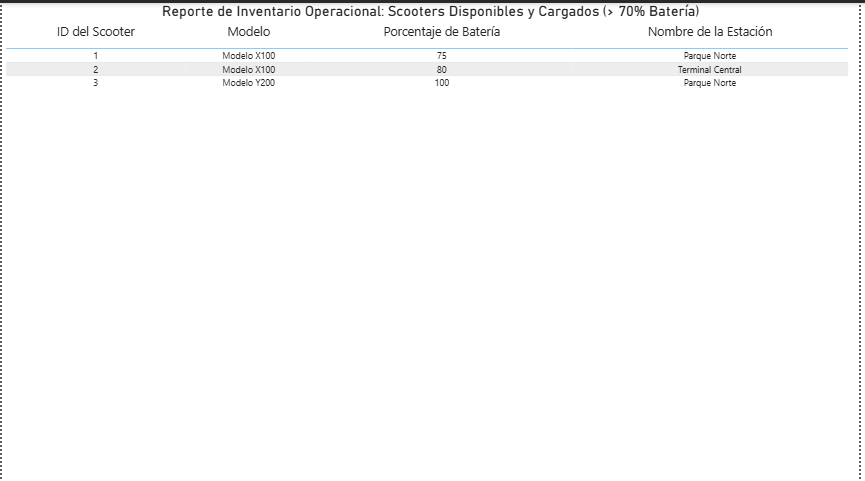
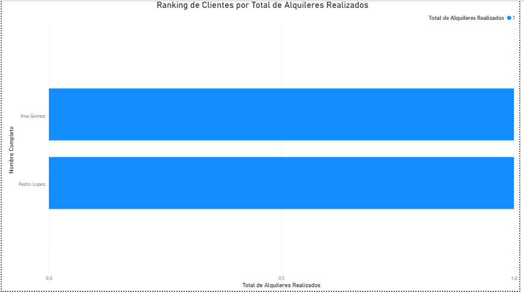
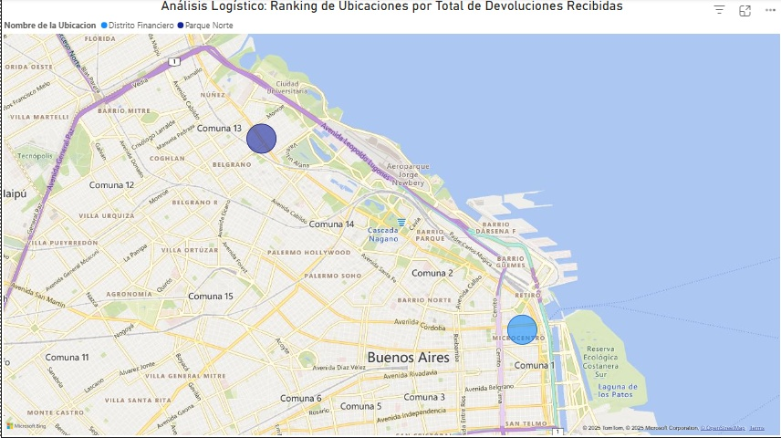

# Proyecto N°2: Base de Datos Transaccional para Alquiler de Scooters

## 1. Objetivo y Resumen Ejecutivo

Este proyecto tiene como objetivo diseñar y modelar una base de datos relacional para gestionar el **ciclo transaccional completo** de alquiler de *scooters* eléctricos. El sistema permite el registro de clientes, la gestión del inventario (estado y ubicación de *scooters*), el seguimiento de alquileres y el análisis logístico.

**Resumen:** Se implementó un esquema relacional para un negocio de movilidad (DDL/DML), se definieron claves foráneas complejas (doble relación con `Ubicacion`), se crearon consultas analíticas clave y se generó un *dashboard* interactivo en Power BI para el análisis logístico y operacional.

---

## 2. Tecnologías y Herramientas Utilizadas

| Categoría | Herramienta | Uso Específico |
| :--- | :--- | :--- |
| **Base de Datos** | PostgreSQL | Almacenamiento y ejecución de SQL. |
| **Modelado** | DBeaver | Diseño del Diagrama Entidad-Relación (ERD). |
| **Análisis** | SQL (VIEW, JOINs, GROUP BY, HAVING) | Desarrollo de las Consultas Analíticas Clave. |
| **Visualización** | Power BI | Creación del Dashboard de Inventario, Ranking de Clientes y Logística. |

---

## 3. Resultados Clave y Visualizaciones

### A. Diseño del Modelo de Datos (ERD)

El esquema utiliza un modelo relacional centrado en la tabla `Alquiler`, que gestiona las transacciones entre las entidades. El uso de claves foráneas asegura la integridad referencial en todo el flujo de trabajo del *scooter*.

* **Tablas Principales:**
    * `Cliente`: Información de los usuarios.
    * `Ubicacion`: Contiene los datos geográficos (`latitud`, `longitud`) de las estaciones.
    * `Scooter`: Estado operativo (`Disponible`, `Alquilado`) y nivel de batería.
    * `Alquiler`: Registro de la transacción, relacionado dos veces a `Ubicacion` (recogida y devolución).

### B. Análisis de Business Intelligence (Power BI Dashboard)

El *dashboard* consolida las métricas clave para la operación del negocio, basándose en las consultas analíticas de `Consultas_Clave_Proyecto2.sql`:

#### **Gráfico 1: Reporte de Inventario Operacional**
* **Enfoque:** Disponibilidad y Operación. Se basa en la **Vista `Scooters_Disponibles`** (Consulta 1), filtrando solo los *scooters* listos para alquilar (`estado = 'Disponible' AND bateria_porcentaje > 70`).
* **Visualización:** Tabla de reporte de *stock* en tiempo real.
    
#### **Gráfico 2: Ranking de Clientes por Total de Alquileres**
* **Enfoque:** Fidelización. Utiliza la Consulta 3, aplicando `COUNT` y `GROUP BY` para generar un *ranking* de clientes basado en su actividad transaccional.
* **Visualización:** Gráfico de barras horizontal que clasifica a los clientes activos.
    
#### **Gráfico 3: Análisis Logístico de Devoluciones**
* **Enfoque:** Logística y Geografía. Utiliza la Consulta 4 y el comando **`HAVING`** para identificar las ubicaciones que más devoluciones reciben. Esta información es crítica para la redistribución de la flota.
* **Visualización:** Mapa geográfico con burbujas de diferente tamaño, donde el tamaño representa el `Total_Devoluciones_Recibidas`.
    
---

## 4. Procedimiento y Fases del Proyecto

1.  **Fase 1: Modelado y DDL/DML:** Creación del esquema con cuatro tablas y definición de claves primarias y foráneas. Se destaca la doble relación de la tabla `Alquiler` con `Ubicacion`.
2.  **Fase 2: Consultas Analíticas (SQL):** Desarrollo de las consultas clave para negocio: creación de una `VIEW` (Inventario), uso de *JOINs* múltiples (Reporte Transaccional), agregación con `GROUP BY` (Ranking de Clientes) y uso de la cláusula **`HAVING`** para filtrar por métricas agregadas (Logística).
3.  **Fase 3: Análisis de BI:** Conexión de Power BI a la base de datos para la generación del Dashboard, usando los resultados de las consultas analíticas como fuentes de datos.

---

## 5. Estructura del Repositorio y Archivos

* **`Proyecto N°2 - Base de Datos Transaccional para Alquiler de Scooters.sql`**: Contiene la sentencia `CREATE DATABASE`, el DDL (tablas) y el DML (inserción de datos).
* **`Consultas_Clave_Proyecto2.sql`**: Contiene las consultas analíticas clave.
* **`README.md`**: Documentación del proyecto.
* **`assets/`**: Carpeta que contiene las imágenes del ERD (`Proyecto2_ERD.png`) y los gráficos de Power BI (`Proyecto2_Inventario_Operacional.png`, `Proyecto2_Clientes_Alquileres.png`, `Proyecto2_Mapa_Geográfico.png`).

---

## 6. Conclusiones

La base de datos relacional modelada permite un seguimiento robusto de las transacciones. El análisis de las consultas, especialmente el uso del mapa logístico, valida la capacidad del modelo para proporcionar **información accionable** (decisiones logísticas) para una empresa de movilidad moderna.

---