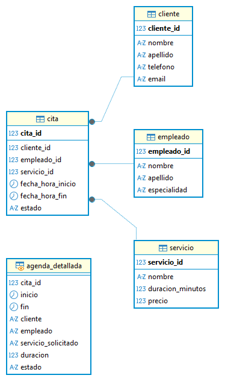
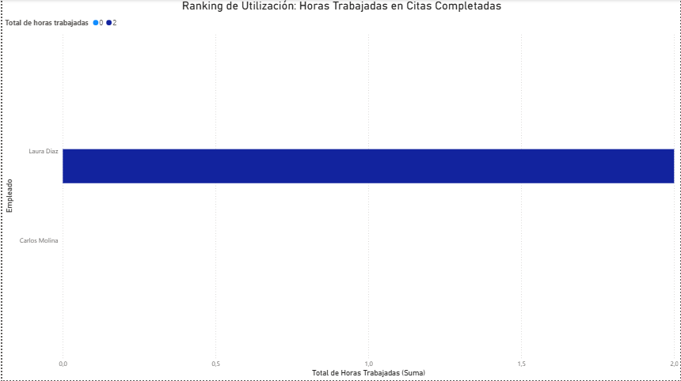
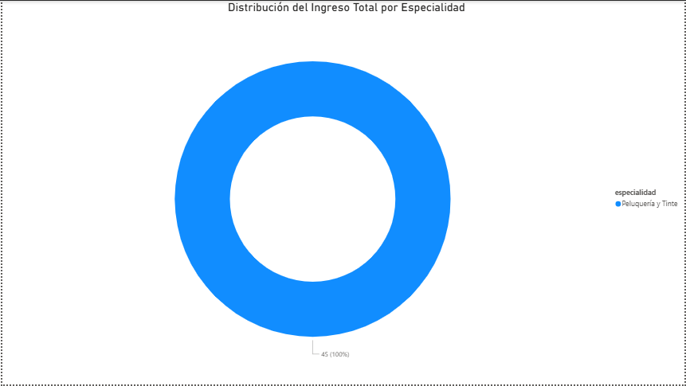

# Proyecto N°3: Modelado de Base de Datos - Planificador de Citas para Salón de Belleza

## 1. Objetivo y Resumen Ejecutivo

Este proyecto tiene como objetivo diseñar y modelar una base de datos relacional para la gestión operativa y financiera de un salón de belleza. El esquema permite registrar clientes, empleados, servicios y, lo más importante, las transacciones de citas con sus estados y duraciones.

**Resumen:** Se implementó un esquema relacional normalizado. Se cargaron datos DDL/DML y se desarrollaron consultas analíticas que fueron visualizadas en un dashboard de Business Intelligence (Power BI) para obtener métricas clave de **capacidad operativa** (Utilización de Empleados) y **rentabilidad** (Ingreso por Especialidad).

---

## 2. Tecnologías y Herramientas Utilizadas

| Categoría | Herramienta | Uso Específico |
| :--- | :--- | :--- |
| **Base de Datos** | PostgreSQL | Almacenamiento, DDL, DML y ejecución de SQL. |
| **Modelado** | DBeaver | Diseño y generación del Diagrama Entidad-Relación (ERD). |
| **Análisis** | SQL (EXTRACT, COALESCE, JOINs, GROUP BY) | Desarrollo de Consultas Analíticas con manejo de tiempo y agregación. |
| **Visualización** | Power BI | Creación del Dashboard de Utilización de Empleados e Ingreso por Especialidad. |

---

## 3. Resultados Clave y Visualizaciones

### A. Diseño del Modelo de Datos (ERD)

El esquema utiliza un modelo relacional centrado en la tabla transaccional **`Cita`**, que actúa como un punto de encuentro (many-to-many) entre las entidades principales: **`Cliente`**, **`Empleado`** y **`Servicio`**.

### B. Consultas Analíticas Clave

El proyecto se centró en dos métricas analíticas principales para la toma de decisiones:

1.  **Análisis de Capacidad:** Uso de funciones avanzadas de tiempo (`EXTRACT(EPOCH)`) para calcular las **Horas Trabajadas Totales** por cada empleado a partir de la diferencia entre `fecha_hora_inicio` y `fecha_hora_fin`.
2.  **Análisis Financiero:** Uso de `SUM` y `GROUP BY` sobre el precio del servicio para obtener el **Ingreso Total por Especialidad**, identificando las áreas más rentables del negocio.

### C. Dashboard de Power BI

Se realizó la conexión de Power BI a la base de datos para la generación del Dashboard que visualiza las dos consultas analíticas:

* **Gráfico N°1:** Ranking de Utilización de Empleados.
    
* **Gráfico N°2:** Distribución del Ingreso Total por Especialidad.
    
---

## 4. Metodología de Trabajo

El desarrollo del proyecto siguió un flujo de trabajo estructurado en las siguientes fases:

1.  **Fase 1: Modelado y DDL/DML:** Creación del esquema relacional en DBeaver. Se implementaron el DDL y DML en PostgreSQL, incluyendo los comandos de **`UPDATE`** para asegurar que los datos de prueba fueran consistentes con las métricas de negocio requeridas.
2.  **Fase 2: Consultas Analíticas (SQL Avanzado):** Desarrollo de las consultas clave, utilizando **`LEFT JOIN`** y funciones de manejo de `TIMESTAMP` para calcular duraciones de tiempo, un requerimiento avanzado en bases de datos.
3.  **Fase 3: Análisis de BI:** Conexión de Power BI a PostgreSQL y visualización de las dos métricas clave de capacidad y rentabilidad, validando la funcionalidad del cálculo de horas con datos reales.

---

## 5. Estructura del Repositorio y Archivos

* **`Proyecto N°3 - Planificador de Citas para Salon de Belleza.sql`**: Contiene la sentencia `CREATE DATABASE`, el DDL, el DML y las correcciones de datos de prueba (`UPDATE`).
* **`Consultas_Clave_Proyecto3.sql`**: Contiene las consultas analíticas clave (`Consulta N°1` y `Consulta N°2`).
* **`README.md`**: Documentación del proyecto.
* **`assets/`**: Carpeta que contiene el Diagrama Entidad-Relación (ERD) y las capturas de los gráficos de Power BI.

---

## 6. Conclusiones

La base de datos modelada permite la gestión eficiente de transacciones de tiempo y personal. Las métricas de **Utilización de Empleados** y **Rentabilidad por Servicio** proporcionan a la administración del salón una visión crítica y en tiempo real sobre la capacidad operativa y la toma de decisiones estratégicas.

---

# Project N°3: Database Modeling - Appointment Scheduler for a Beauty Salon

## 1. Objective and Project Overview

This project aims to design and model a relational database for the operational and financial management of a beauty salon. The schema allows for the registration of clients, employees, services, and, most importantly, appointment transactions with their statuses and durations.

**Summary**: A normalized relational schema was implemented. DDL/DML data was loaded, and analytical queries were developed and visualized in a Business Intelligence dashboard (Power BI) to obtain key metrics of **operational capacity** (Employee Utilization) and **profitability** (Revenue by Specialty).

---

## 2. Technologies and Tools Used

| Category | Tool | Specific Use |
| :--- | :--- | :--- |
| **Database** | PostgreSQL | Storage, DDL, DML, and SQL execution. |
| **Modeling** | DBeaver | Design and generation of the Entity-Relationship Diagram (ERD). |
| **Analysis** | SQL (EXTRACT, COALESCE, JOINs, GROUP BY) | Development of Analytical Queries with time management and aggregation. |
| **Visualization** | Power BI | Creation of the Employee Utilization and Revenue by Specialty Dashboard.

---

## 3. Key Results and Visualizations

### A. Data Model Design (ERD)

The schema uses a relational model centered on the transactional **`Cita`** table, which acts as a many-to-many meeting point between the main entities: **`Cliente`**, **`Empleado`**, and **`Servicio`**.

### B. Key Analytical Queries

The project focused on two main analytical metrics for decision-making:

1. **Capacity Analysis**: Use of advanced time functions (`EXTRACT(EPOCH)`) to calculate the Total Hours Worked (*Horas Totales Trabajadas*) by each employee based on the difference between `fecha_hora_inicio` and `fecha_hora_fin`.
2. **Financial Analysis**: Use of `SUM` and `GROUP BY` on the service price to obtain Total Revenue by Specialty (*Ingreso Total por Especialidad*), identifying the most profitable areas of the business.

### C. Power BI Dashboard

Power BI was connected to the database to generate the dashboard that displays the two analytical queries:

* **Visualization 1**: Employee Utilization Ranking.

    

* **Visualization 2**: Total Revenue Distribution by Specialty.

    

---

## 4. Work Methodology

The project development followed a structured workflow in the following phases:

1. **Phase 1: Modeling and DDL/DML**: Creation of the relational schema in DBeaver. DDL and DML were implemented in PostgreSQL, including `UPDATE` commands to ensure that the test data was consistent with the required business metrics.
2. **Phase 2: Analytical Queries (Advanced SQL)**: Development of key queries, using `LEFT JOIN` and `TIMESTAMP` handling functions to calculate time durations, an advanced database requirement.
3. **Phase 3: BI Analysis**: Connecting Power BI to PostgreSQL and visualizing the two key metrics of capacity and profitability, validating the functionality of the hours calculation with real data.

---

## 5. Repository and File Structure

* **`Proyecto N°3 - Planificador de Citas para Salon de Belleza.sql`**: Contains the `CREATE DATABASE` statement, the DDL, the DML, and the test data corrections (`UPDATE`).
* **`Consultas_Clave_Proyecto3.sql`**: Contains the key analytical queries (Query 1 and Query 2).
* **`README.md`**: Project documentation.
* **`assets/`**: Folder containing the Entity-Relationship Diagram (ERD) and Power BI chart screenshots.

---

## 6. Conclusions
The modeled database enables the efficient management of time and personnel transactions. Employee Utilization and Profitability per Service metrics provide salon management with a critical, real-time view of operational capacity and strategic decision-making.

---
