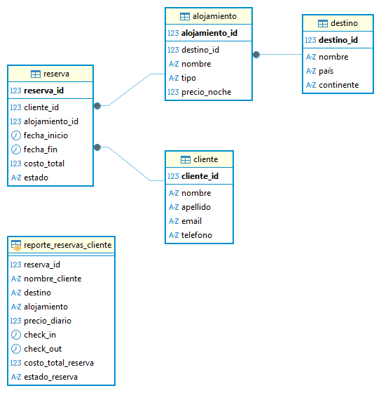
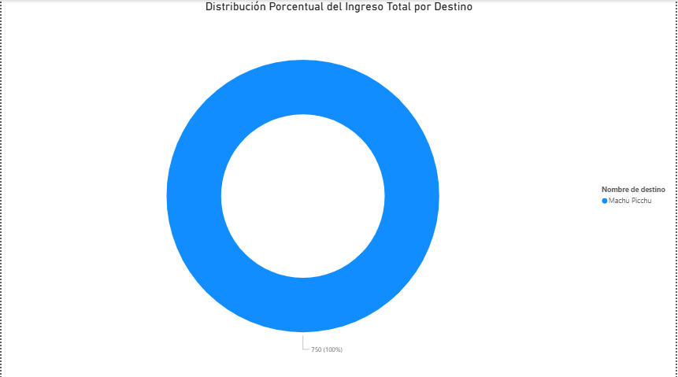
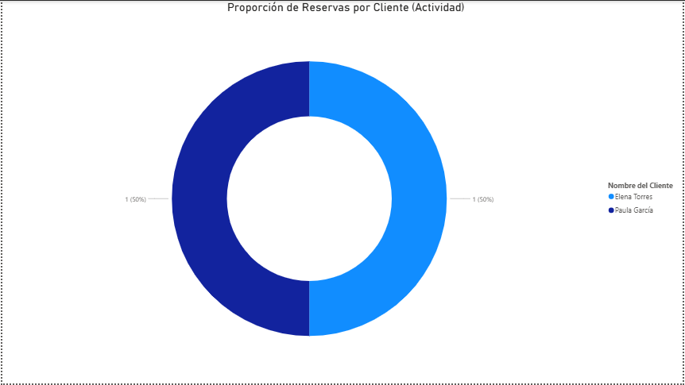
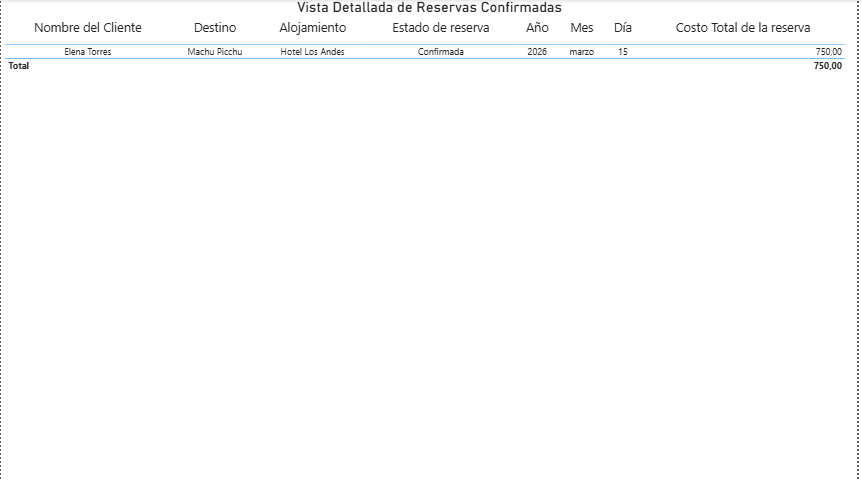

# Proyecto N°4: Modelado de Base de Datos - Agencia de Viajes

## 1. Objetivo y Resumen Ejecutivo

Este proyecto tiene como objetivo diseñar y modelar una base de datos relacional para gestionar las transacciones de reservas de una agencia de viajes. El foco está en el manejo de la lógica de fechas avanzada para verificar la disponibilidad de alojamientos y en generar métricas clave de **rentabilidad y actividad de clientes**.

**Resumen:** Se implementó un esquema relacional con tablas de catálogo (`Cliente`, `Destino`, `Alojamiento`) y la tabla transaccional central (`Reserva`). Se desarrollaron consultas SQL analíticas y de validación de negocio, las cuales fueron visualizadas en Power BI para medir los ingresos por destino y el ranking de clientes más activos.

---

## 2. Tecnologías y Herramientas Utilizadas

| Categoría | Herramienta | Uso Específico |
| :--- | :--- | :--- |
| **Base de Datos** | PostgreSQL | Almacenamiento, DDL, DML y ejecución de SQL. |
| **Modelado** | DBeaver | Diseño y generación del Diagrama Entidad-Relación (ERD). |
| **Análisis** | SQL (JOINs, SUM, GROUP BY, Lógica de Fechas) | Desarrollo de Consultas Analíticas y de Validación de Disponibilidad. |
| **Visualización** | Power BI | Creación del Dashboard de Ingresos por Destino y Ranking de Clientes. |

---

## 3. Resultados Clave y Visualizaciones

### A. Diseño del Modelo de Datos (ERD)
El esquema relacional se basa en la conexión jerárquica: `Cliente` y `Alojamiento` se relacionan con la tabla central **`Reserva`**. `Alojamiento` se relaciona con la tabla **`Destino`**, lo que permite el análisis geográfico y financiero.

### B. Consultas Analíticas Clave
El proyecto se centró en métricas financieras y de negocio, además de una lógica de validación crítica:

1.  **Análisis de Rentabilidad:** Uso de `SUM` y `GROUP BY` sobre la tabla `Reserva` para calcular el **Ingreso Total por Destino**, identificando los productos de mayor valor.
2.  **Análisis de Actividad:** Uso de `COUNT` y `GROUP BY` para obtener el **Ranking de Clientes más Activos** según el total de reservas realizadas.
3.  **Validación de Conflicto:** Desarrollo de una consulta avanzada con **lógica de no superposición de fechas** para verificar la disponibilidad de un alojamiento, una función crítica para la lógica transaccional.

### C. Dashboard de Power BI
Se generó un dashboard para visualizar los resultados analíticos:

* **Gráfico N°1:** **Distribución Porcentual del Ingreso Total por Destino** (Gráfico de Anillo).
    
* **Gráfico N°2:** **Proporción de Reservas por Cliente (Actividad)** (Gráfico de Anillo).
    
* **Gráfico N°3:** **Vista Detallada de Reservas Confirmadas** (Tabla Transaccional).
    

---

## 4. Metodología de Trabajo

El desarrollo del proyecto siguió un flujo de trabajo estructurado en las siguientes fases:

1.  **Fase 1: Modelado y DDL/DML:** Creación del esquema relacional y carga de datos iniciales. Se enfocó en asegurar la consistencia de los datos en la tabla `Reserva` para que reflejaran estados (`Confirmada`, `Cancelada`) adecuados para el análisis financiero.
2.  **Fase 2: Consultas Analíticas (SQL):** Desarrollo de las consultas clave, destacando el uso de `SUM` y `GROUP BY` para agregaciones financieras y la implementación de la **lógica de fechas** para la validación de reservas.
3.  **Fase 3: Análisis de BI:** Conexión de Power BI a las consultas clave y visualización de las métricas de rentabilidad y actividad, utilizando gráficos de anillo para mostrar la proporción de los datos de prueba, así como de una tabla transaccional en el último caso.

---

## 5. Estructura del Repositorio y Archivos

* **`Proyecto N°4 - Base de Datos de Agencia de Viajes.sql`**: Contiene la sentencia `CREATE DATABASE`, el DDL (tablas) y el DML (inserción de datos de prueba).
* **`Consultas_Clave_Proyecto4.sql`**: Contiene las cuatro consultas clave, incluyendo las dos analíticas y la lógica de conflicto de fechas.
* **`README.md`**: Documentación del proyecto.
* **`assets/`**: Carpeta que contiene el Diagrama Entidad-Relación (ERD) y las capturas de los gráficos de Power BI.

---

## 6. Conclusiones

El modelo de datos desarrollado es robusto para gestionar transacciones de viaje, permitiendo el almacenamiento de datos complejos como fechas y costos. El análisis resultó en la identificación de los **destinos más rentables** y los **clientes más activos**, proporcionando información valiosa para la gestión de inventario y las campañas de marketing.

---

# Project 4: Database Modeling - Travel Agency

## 1. Objective and Project Overview

This project aims to design and model a relational database to manage booking transactions for a travel agency. The focus is on handling advanced date logic to verify accommodation availability and generating key metrics for profitability and customer activity.

**Summary**: A relational schema was implemented with catalog tables (`Cliente`, `Destino`, `Alojamiento`) and the central transactional table (`Reserva`). Analytical and business validation SQL queries were developed and visualized in Power BI to measure revenue by destination and the ranking of the most active customers.

---

## 2. Technologies and Tools Used

| Category | Tool | Specific Use |
| :--- | :--- | :--- |
| **Databases** | PostgreSQL | Storage, DDL, DML, and SQL execution. |
| **Modeling** | DBeaver | Design and generation of the Entity-Relationship Diagram (ERD). |
| **Analysis** | SQL (JOINs, SUM, GROUP BY, Date Logic) |Development of Analytical and Availability Validation Queries. |
| **Visualization** | Power BI | Creation of the Revenue by Destination Dashboard and Customer Ranking. |

---

## 3. Key Results and Visualizations

### A. Data Model Design (ERD)

The relational schema is based on a hierarchical connection: `Cliente` and `Alojamiento` are related to the central `Reserva` table. `Alojamiento` is related to the `Destino` table, enabling geographic and financial analysis.

### B. Key Analytical Queries
The project focused on financial and business metrics, as well as critical validation logic:

1. **Profitability Analysis**: Use of `SUM` and `GROUP BY` on the `Reserva` table to calculate *Total Revenue by Destination* (Ingreso Total por Destino), identifying the highest-value products.
2. **Activity Analysis**: Use of `COUNT` and `GROUP BY` to obtain the *Ranking of the Most Active Customers* (Ranking de Clientes más Activos) based on the total number of reservations made.
3. **Conflict Validation**: Development of an advanced query with date non-overlapping logic to verify accommodation availability, a critical function for transactional logic.

### C. Power BI Dashboard
A dashboard was generated to visualize the analytical results:

* **Visualization 1**: Percentage Distribution of Total Revenue by Destination (Donut Chart).

    

* **Visualization 2**: Proportion of Reservations by Client (Activity) (Donut Chart).

    

* **Visualization 3**: Detailed View of Confirmed Reservations (Transactional Table).

    

---

## 4. Work Methodology
The project development followed a structured workflow in the following phases:

1. **Phase 1: Modeling and DDL/DML**: Creation of the relational schema and initial data loading. The focus was on ensuring data consistency in the `Reserva` table so that it reflected statuses (`Confirmada`, `Cancelada`) appropriate for financial analysis.
2. **Phase 2: Analytical Queries (SQL)**: Development of key queries, highlighting the use of `SUM` and `GROUP BY` for financial aggregations and the implementation of date logic for reservation validation.
3. **Phase 3: BI Analysis**: Connecting Power BI to the key queries and visualizing profitability and activity metrics, using pie charts to show the proportion of test data, as well as a transactional table in the latter case.

---

## 5. Repository Structure and Files

* **`Proyecto N°4 - Base de Datos de Agencia de Viajes.sql`**: Contains the `CREATE DATABASE` statement, the DDL (tables), and the DML (insertion of test data).
* **`Consultas_Clave_Proyecto4.sql`**: Contains the four key queries, including the two analytical queries and the date conflict logic.
* **`README.md`**: Project documentation.
* **`assets/`**: Folder containing the Entity-Relationship Diagram (ERD) and Power BI chart screenshots.

---

## 6. Conclusions
The developed data model is robust for managing travel transactions, allowing the storage of complex data such as dates and costs. The analysis resulted in the identification of the most profitable destinations and the most active customers, providing valuable information for inventory management and marketing campaigns.
