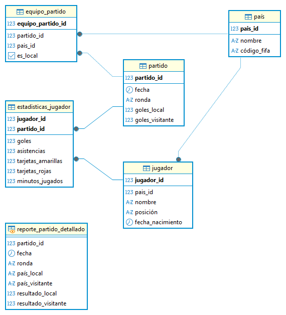
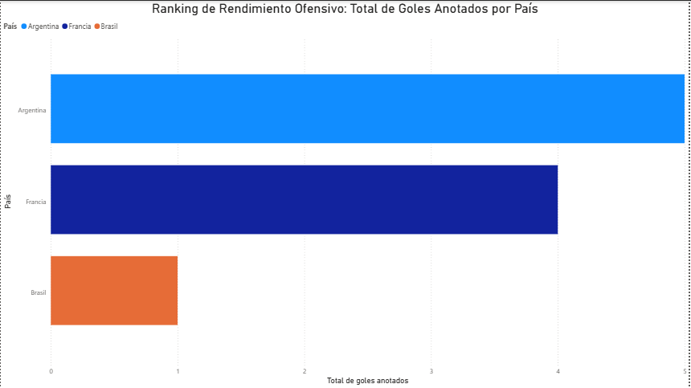
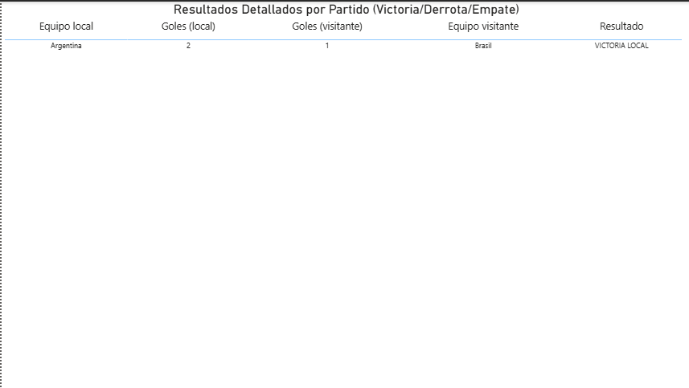
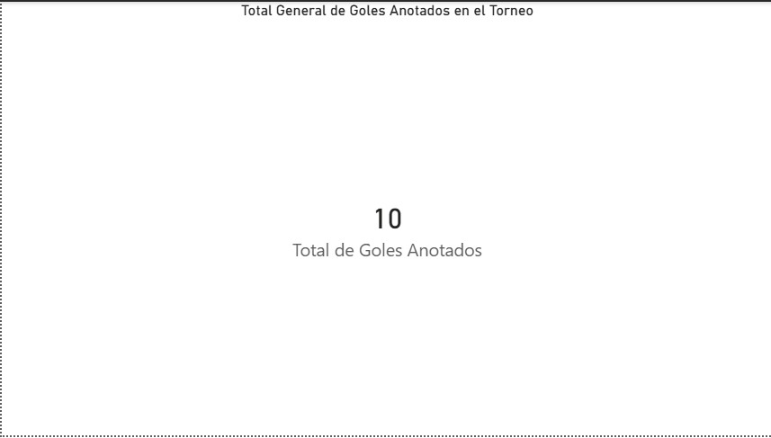

# Proyecto N°5: Modelado de Base de Datos - Copa del Mundo

## 1. Objetivo y Resumen Ejecutivo

Este proyecto tiene como objetivo diseñar y modelar una base de datos relacional avanzada para gestionar la información de un torneo de fútbol (Copa del Mundo). El foco está en el manejo de la **relación Muchos a Muchos (N:M)** entre países y partidos, y en el desarrollo de lógica condicional para el análisis de resultados.

**Resumen:** Se implementó un esquema relacional con una **tabla de enlace** (`Equipo_Partido`) para conectar países y partidos. Se desarrollaron consultas SQL con **`CASE WHEN`** para calcular métricas de rendimiento y determinar el resultado de cada encuentro, las cuales fueron visualizadas en un dashboard de Power BI.

---

## 2. Tecnologías y Herramientas Utilizadas

| Categoría | Herramienta | Uso Específico |
| :--- | :--- | :--- |
| **Base de Datos** | PostgreSQL | Almacenamiento, DDL, DML y ejecución de SQL. |
| **Modelado** | DBeaver | Diseño del Diagrama Entidad-Relación (ERD). |
| **Análisis** | SQL (N:M JOINs, CASE WHEN, SUM, GROUP BY) | Desarrollo de Consultas de rendimiento y resultados condicionales. |
| **Visualización** | Power BI | Creación del Dashboard de Ranking de Goles y Resultados Detallados. |

---

## 3. Resultados Clave y Visualizaciones

### A. Diseño del Modelo de Datos (ERD)
El esquema se basa en una relación de **Muchos a Muchos (N:M)** entre las tablas **`País`** y **`Partido`**, resuelta mediante la tabla de enlace **`Equipo_Partido`**. Esta tabla incluye el campo `es_local` para registrar la función de cada equipo, lo cual es vital para el análisis.

### B. Consultas Analíticas Clave
El proyecto se centró en dos métricas analíticas principales que demuestran el manejo de lógica compleja:

1.  **Ranking de Goles:** Uso de **`CASE WHEN`** dentro de una función **`SUM`** agregada para calcular el total de goles anotados por cada país, tomando el valor correcto de `goles_local` o `goles_visitante` según corresponda.
2.  **Lógica de Resultados:** Uso de **`CASE WHEN`** fuera de una función agregada para transformar la diferencia numérica de goles en una categoría textual de negocio (**"VICTORIA LOCAL"**, **"DERROTA LOCAL"**, o **"EMPATE"**).

### C. Dashboard de Power BI
Se generó un dashboard para visualizar los resultados analíticos:

* **Gráfico N°1:** **Ranking de Rendimiento Ofensivo: Total de Goles Anotados por País** (Gráfico de Barras).
    
* **Gráfico N°2:** **Resultados Detallados por Partido (Victoria/Derrota/Empate)** (Tabla o Matriz).
    
* **Gráfico N°3:** **Total General de Goles Anotados en el Torneo** (Tarjeta).
    

---

## 4. Metodología de Trabajo

El desarrollo del proyecto siguió un flujo de trabajo estructurado en las siguientes fases:

1.  **Fase 1: Modelado y DDL/DML:** Creación del esquema relacional N:M y carga de datos. Se puso énfasis en la correcta inserción de datos en la tabla `Equipo_Partido` para reflejar con precisión qué país jugó como local (`es_local = TRUE`) o visitante.
2.  **Fase 2: Consultas Analíticas (SQL Avanzado):** Desarrollo de las consultas clave, utilizando **múltiples `JOIN`s** para navegar la relación N:M y la implementación avanzada de la sentencia **`CASE WHEN`** para generar métricas de rendimiento y resultados categóricos.
3.  **Fase 3: Análisis de BI:** Conexión de Power BI a las consultas clave y visualización de las métricas. Se utilizó un Gráfico de Barras para el ranking y una Tabla para la verificación de la lógica condicional de los resultados.

---

## 5. Estructura del Repositorio y Archivos

* **`Proyecto N°5 - Base de Datos de la Copa del Mundo.sql`**: Contiene la sentencia `CREATE DATABASE`, el DDL (tablas), y el DML (inserción de datos de prueba).
* **`Consultas_Clave_Proyecto5.sql`**: Contiene las consultas analíticas clave, incluyendo la lógica condicional y la agregación de goles.
* **`README.md`**: Documentación del proyecto.
* **`assets/`**: Carpeta que contiene el Diagrama Entidad-Relación (ERD) y las capturas de los gráficos de Power BI.

---

## 6. Conclusiones

El modelo de datos de la Copa del Mundo prueba la habilidad de trabajar con relaciones complejas (N:M) y la lógica de negocio condicional directamente en SQL. Las consultas y visualizaciones permiten un **análisis de rendimiento** preciso y la categorización automática de resultados, ofreciendo información valiosa y en tiempo real sobre el progreso del torneo.

---