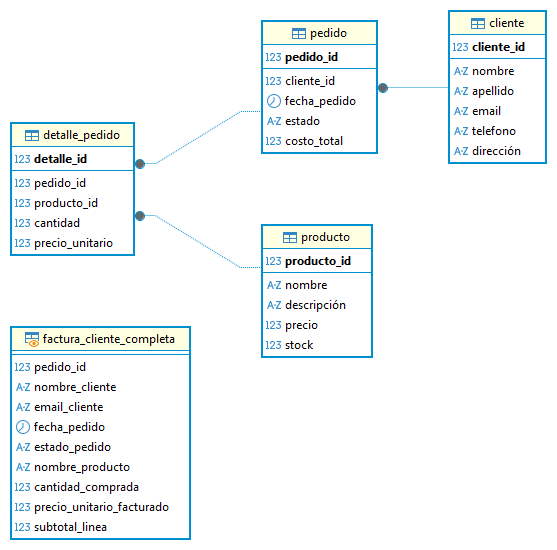
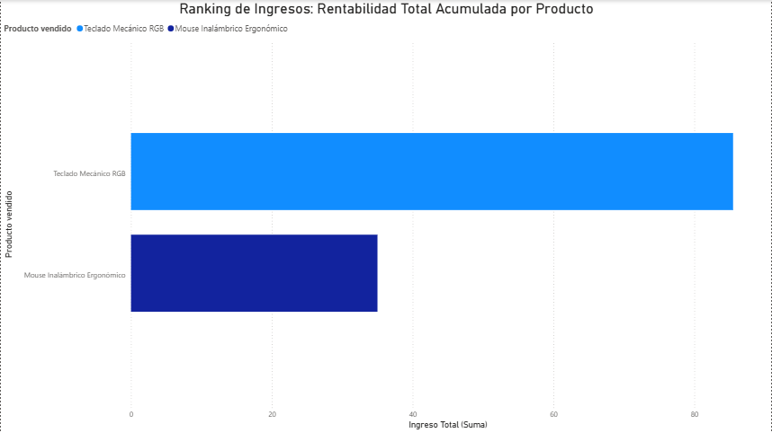
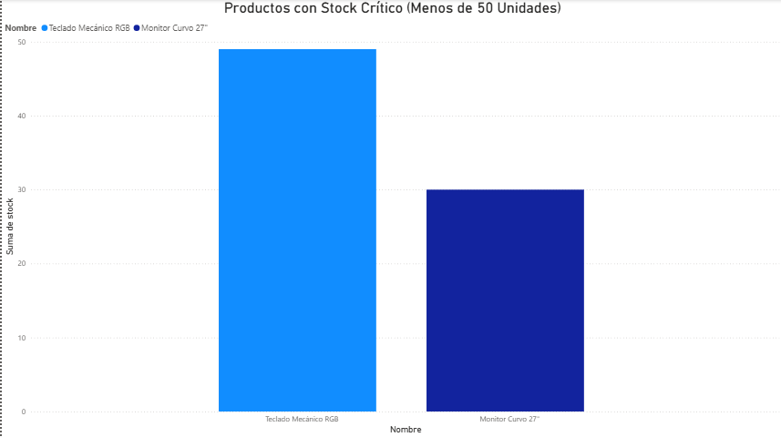
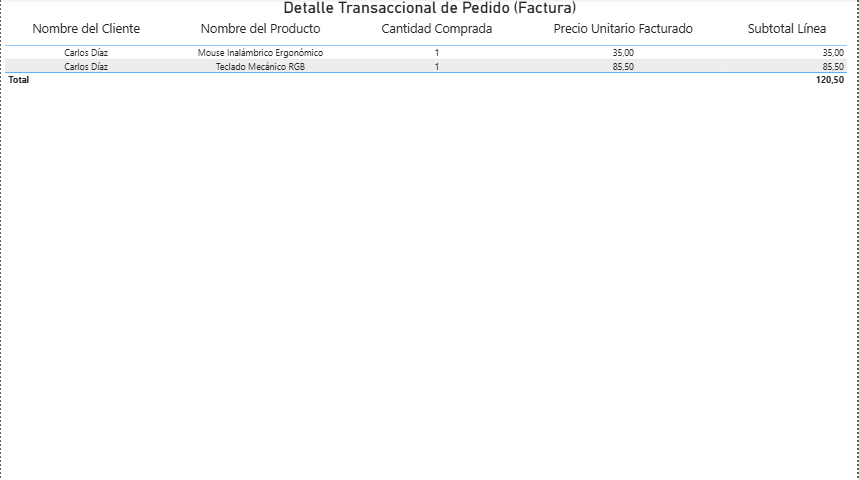

# Proyecto N°6: Modelado de Base de Datos - Plataforma de E-Commerce

## 1. Objetivo y Resumen Ejecutivo

Este proyecto tiene como objetivo diseñar y modelar una base de datos relacional para una plataforma de comercio electrónico. El foco está en el manejo de transacciones de **facturación (pedidos y detalles)** y en la gestión de **inventario** en tiempo real.

**Resumen:** Se implementó un esquema relacional que utiliza una tabla de enlace (Muchos a Muchos) para gestionar el proceso de pedido y facturación. Se desarrollaron consultas SQL analíticas clave para calcular la **rentabilidad por producto** y para generar alertas de **inventario crítico**, las cuales fueron visualizadas en Power BI.

---

## 2. Tecnologías y Herramientas Utilizadas

| Categoría | Herramienta | Uso Específico |
| :--- | :--- | :--- |
| **Base de Datos** | PostgreSQL | Almacenamiento, DDL, DML y ejecución de SQL. |
| **Modelado** | DBeaver | Diseño y generación del **Diagrama Entidad-Relación (ERD)**. |
| **Análisis** | SQL (N:M JOINs, SUM, GROUP BY, Filtrado Condicional) | Desarrollo de Consultas de rentabilidad y gestión de stock. |
| **Visualización** | Power BI | Creación del Dashboard de Ranking de Ingresos e Inventario Crítico. |

---

## 3. Resultados Clave y Visualizaciones

### A. Diseño del Modelo de Datos (ERD)

El esquema relacional utiliza el patrón clásico de facturación (o Muchos a Muchos), donde las tablas **`Pedido`** y **`Producto`** se conectan a través de la tabla central **`Detalle_Pedido`** (la línea de la factura), lo que permite manejar múltiples productos por pedido.

### B. Consultas Analíticas Clave

El proyecto se centró en métricas financieras (rentabilidad) y operacionales (inventario):

1.  **Ranking de Ingresos:** Uso de `SUM` y `GROUP BY` sobre el `Detalle_Pedido` para calcular la rentabilidad precisa de cada producto vendido (`cantidad * precio_unitario`).
2.  **Alerta de Inventario:** Desarrollo de una consulta simple pero crítica para la logística, utilizando `WHERE stock < 50` para identificar productos en **stock crítico** que requieren reabastecimiento urgente.
3.  **Detalle de Facturación:** Consulta que valida el modelo N:M al reconstruir la factura completa de un pedido específico, uniendo Cliente, Pedido y Detalle_Pedido.

### C. Dashboard de Power BI

Se generó un dashboard para visualizar los resultados analíticos y operativos:

* **Gráfico N°1:** **Ranking de Ingresos: Rentabilidad Total Acumulada por Producto** (Gráfico de Barras).
    

* **Gráfico N°2:** **Productos con Stock Crítico (Menos de 50 Unidades)** (Gráfico de Columnas).
    

* **Gráfico N°3:** **Detalle Transaccional de Pedido (Factura)** (Tabla).
    

---

## 4. Metodología de Trabajo

El desarrollo del proyecto siguió un flujo de trabajo estructurado en las siguientes fases:

1.  **Fase 1: Modelado y DDL/DML:** Creación del esquema relacional N:M, asegurando la integridad referencial y la correcta inserción de datos de clientes, productos y transacciones (pedidos y detalles).
2.  **Fase 2: Consultas Analíticas (SQL Avanzado):** Desarrollo de las consultas clave, destacando el uso de agregaciones (`SUM`) para cálculos financieros precisos y el filtrado condicional (`WHERE`) para la gestión de inventario.
3.  **Fase 3: Análisis de BI:** Conexión de Power BI a las tres consultas clave y visualización de las métricas. Se priorizó un diseño de dashboard que provee tanto una visión de alto nivel (rentabilidad) como alertas operativas (stock).

---

## 5. Estructura del Repositorio y Archivos

* **`Proyecto N°6 - Base de Datos de Plataforma de E-Commerce.sql`**: Contiene la sentencia `CREATE DATABASE`, el DDL (tablas) y el DML (inserción de datos de prueba).
* **`Consultas_Clave_Proyecto6.sql`**: Contiene las tres consultas analíticas clave (Rentabilidad, Inventario Crítico, Detalle de Facturación).
* **`README.md`**: Documentación del proyecto.
* **`assets/`**: Carpeta que contiene el Diagrama Entidad-Relación (ERD) y las capturas de los gráficos de Power BI.

---

## 6. Conclusiones

El modelo de E-Commerce es un esquema relacional estándar y robusto que permite análisis vitales. El proyecto demuestra la capacidad de calcular **métricas de rentabilidad** y generar **alertas operacionales** directamente desde la base de datos, proporcionando las herramientas esenciales para optimizar el inventario y maximizar los ingresos del negocio.

---