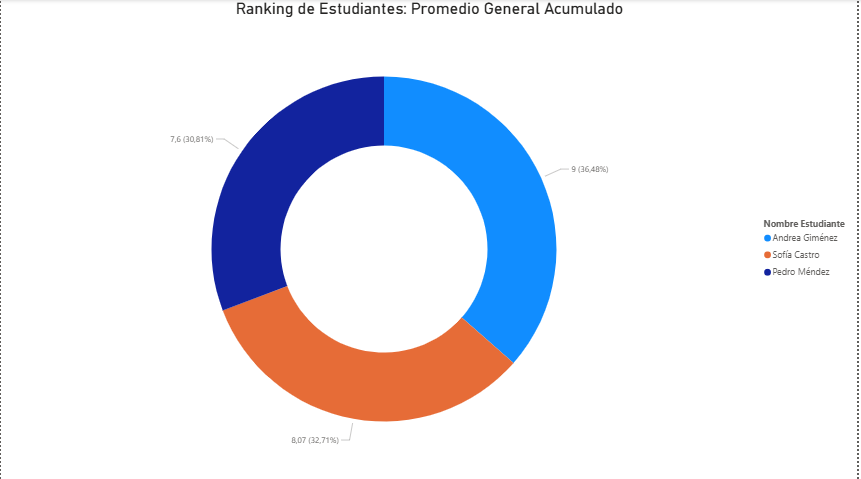

# Proyecto N°7: Modelado de Base de Datos - Gestión Académica

## 1. Objetivo y Resumen Ejecutivo

Este proyecto tiene como objetivo diseñar y modelar una base de datos relacional para gestionar la **información académica** de una institución educativa, incluyendo estudiantes, profesores, cursos y el historial de calificaciones.

**Resumen:** Se implementó un esquema relacional que utiliza la tabla de enlace **`Inscripción`** para modelar la relación Muchos a Muchos (N:M) entre Estudiante y Curso. Se desarrollaron consultas SQL analíticas clave para calcular el **rendimiento promedio por curso** y el **promedio general por estudiante**, las cuales fueron visualizadas en un Dashboard de Power BI.

---

## 2. Tecnologías y Herramientas Utilizadas

| Categoría | Herramienta | Uso Específico |
| :--- | :--- | :--- |
| **Base de Datos** | PostgreSQL | Almacenamiento, DDL, DML y ejecución de SQL. |
| **Modelado** | DBeaver | Diseño y generación del **Diagrama Entidad-Relación (ERD)**. |
| **Análisis** | SQL (AVG, GROUP BY, N:M JOINs) | Desarrollo de Consultas de rendimiento académico. |
| **Visualización** | Power BI | Creación del Dashboard de Ranking de Cursos y Estudiantes. |

---

## 3. Resultados Clave y Visualizaciones

### A. Diseño del Modelo de Datos (ERD)

El esquema relacional utiliza una tabla de enlace central (`Inscripción`) que conecta la entidad **`Estudiante`** con la entidad **`Curso`**. Esta tabla de enlace almacena las calificaciones y el estado final, lo cual es la clave para todos los análisis de rendimiento.

### B. Consultas Analíticas Clave

El proyecto se centró en métricas de rendimiento tanto a nivel de curso como a nivel de estudiante:

1.  **Rendimiento por Curso:** Uso de la función de agregación `AVG` y `GROUP BY` sobre la tabla `Inscripción` para determinar el rendimiento histórico de cada materia y profesor.
2.  **Promedio General por Estudiante:** Uso de `AVG` y `GROUP BY` para calcular la métrica de rendimiento individual más importante, permitiendo un ranking de los estudiantes más destacados.
3.  **Historial Individual:** Consulta que demuestra la capacidad del modelo para generar una **Libreta de Calificaciones** precisa, utilizando una `VIEW` o `JOINs` para obtener el detalle de todas las notas de un estudiante específico.

### C. Dashboard de Power BI

Se generó un dashboard para visualizar los resultados académicos:

* **Gráfico N°1:** **Ranking de Cursos: Rendimiento Histórico (Nota Promedio)** (Gráfico de Barras).
    

* **Gráfico N°2:** **Ranking de Estudiantes: Promedio General Acumulado** (Gráfico de Anillo).
    

* **Gráfico N°3:** **Historial Académico Detallado (Libreta de Calificaciones)** (Tabla).
    

---

## 4. Metodología de Trabajo

El desarrollo del proyecto siguió un flujo de trabajo estructurado en las siguientes fases:

1.  **Fase 1: Modelado y DDL/DML:** Creación del esquema relacional N:M, enfocándose en la tabla `Inscripción` para capturar la nota, el estado y el semestre, asegurando la integridad referencial.
2.  **Fase 2: Consultas Analíticas (SQL Avanzado):** Desarrollo de las consultas clave, utilizando funciones de agregación (`AVG`, `COUNT`) y la cláusula `GROUP BY` para generar reportes estadísticos a diferentes niveles (curso e individuo).
3.  **Fase 3: Análisis de BI:** Conexión de Power BI a las tres consultas clave y visualización de las métricas. Se priorizó un diseño de dashboard que provee tanto una visión de alto nivel (rankings) como la capacidad de detalle transaccional (libreta).

---

## 5. Estructura del Repositorio y Archivos

* **`Proyecto N°7 - Base de Datos de Gestión Académica.sql`**: Contiene la sentencia `CREATE DATABASE`, el DDL (tablas) y el DML (inserción de datos de prueba).
* **`Consultas_Clave_Proyecto7.sql`**: Contiene las tres consultas analíticas clave (Promedio por Curso, Promedio por Estudiante, Historial Individual).
* **`README.md`**: Documentación del proyecto.
* **`assets/`**: Carpeta que contiene el Diagrama Entidad-Relación (ERD) y las capturas de los gráficos de Power BI.

---

## 6. Conclusiones

El modelo de Gestión Académica es un esquema relacional probado que permite la administración precisa de la información de rendimiento. El proyecto demuestra la capacidad de transformar datos de calificaciones en métricas accionables (rankings) que son vitales para la toma de decisiones administrativas y el seguimiento individual del progreso del estudiante.

---

# Project 7: Database Modeling - Academic Management

## 1. Objective and Project Overview

This project aims to design and model a relational database to manage the academic information of an educational institution, including students, professors, courses, and grade history.

**Summary**: A relational schema was implemented using the `Inscripción` (*Enrollment*) link table to model the Many-to-Many (N:M) relationship between `Estudiante` and `Curso`. Key analytical SQL queries were developed to calculate the average performance per course and the overall average per student, which were visualized in a Power BI dashboard.

---

## 2. Technologies and Tools Used

| Category | Tool | Specific Use |
| :--- | :--- | :--- |
| **Databases** | PostgreSQL | Storage, DDL, DML, and SQL execution. |
| **Modeling** | DBeaver | Design and generation of the Entity-Relationship Diagram (ERD). |
| **Analysis** | SQL (AVG, GROUP BY, N:M JOINs) | Development of academic performance queries. |
| **Visualization** | Power BI | Creation of the Course and Student Ranking Dashboard. |

---

## 3. Key Results and Visualizations

### A. Data Model Design (ERD)

The relational schema uses a central link table (`Inscripción`) that connects the `Estudiante` entity with the `Curso` entity. This link table stores grades and final status, which is key for all performance analyses.

### B. Key Analytical Queries

The project focused on performance metrics at both the course and student levels:

1. **Performance by Course**: Using the `AVG` and `GROUP BY` aggregation functions on the `Inscripción` table to determine the historical performance of each subject and professor.
2. **Overall Average by Student**: Using `AVG` and `GROUP BY` to calculate the most important individual performance metric, allowing for a ranking of top students.
3. **Individual History**: A query demonstrating the model's ability to generate an accurate **Gradebook**, using a `VIEW` or `JOINs` to obtain the details of all grades for a specific student.

### C. Power BI Dashboard

A dashboard was created to visualize academic results:

* **Visualization 1**: Course Ranking: Historical Performance (Average Grade) (Bar Chart).
    

* **Visualization 2**: Student Ranking: Cumulative GPA (Donut Chart).
    

* **Visualization 3**: Detailed Academic History (Grade Book) (Table).

    

---

## 4. Work Methodology

The project development followed a structured workflow in the following phases:

1. **Phase 1: Modeling and DDL/DML**: Creation of the N:M relational schema, focusing on the `Inscripción` table to capture the grade, status, and semester, ensuring referential integrity.
2. **Phase 2: Analytical Queries (Advanced SQL)**: Development of key queries, using aggregation functions (`AVG`, `COUNT`) and the `GROUP BY` clause to generate statistical reports at different levels (course and individual).
3. **Phase 3: BI Analysis**: Connecting Power BI to the three key queries and visualizing the metrics. A dashboard design was prioritized that provides both a high-level view (rankings) and transactional detail (gradebook).

---

## 5. Repository and File Structure

* **`Proyecto N°7 - Base de Datos de Gestión Académica.sql`**: Contains the `CREATE DATABASE` statement, the DDL (tables), and the DML (test data insertion).
* **`Consultas_Clave_Proyecto7.sql`**: Contains the three key analytical queries (Average by Course, Average by Student, Individual History).
* **`README.md`**: Project documentation.
* **`assets/`**: Folder containing the Entity-Relationship Diagram (ERD) and Power BI chart screenshots.

---

## 6. Conclusions
The Academic Management model is a proven relational schema that allows for the accurate management of performance information. The project demonstrates the ability to transform grade data into actionable metrics (rankings) that are vital for administrative decision-making and individual student progress tracking.

---
