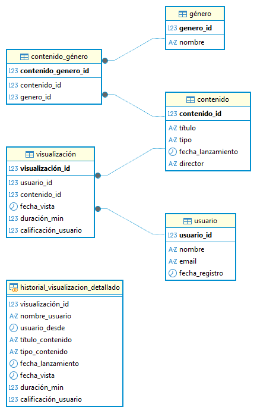
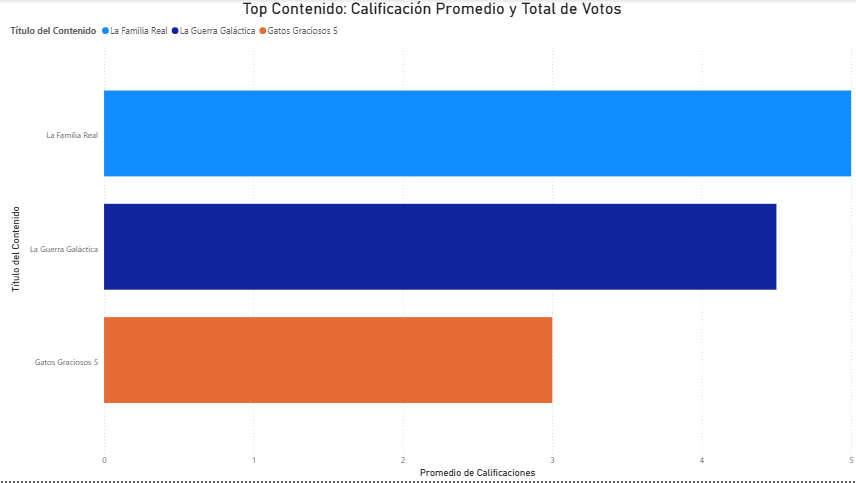
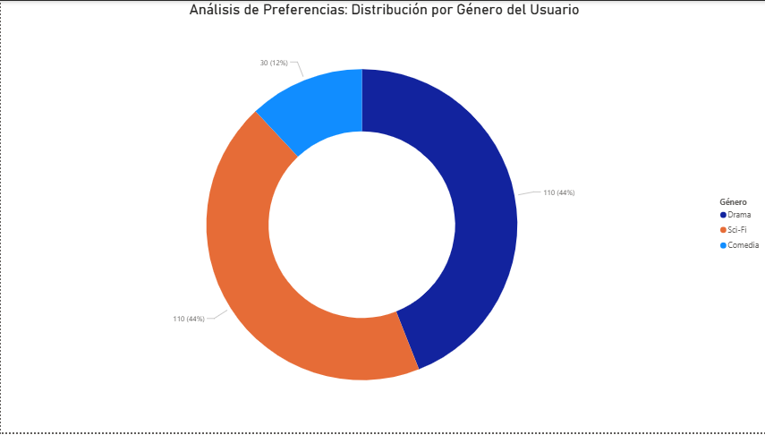
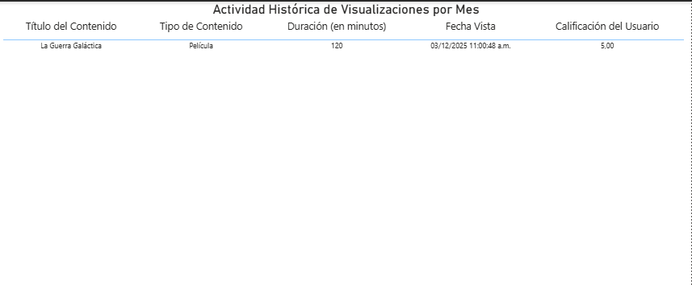

# Proyecto N°8: Base de Datos para un Sistema de Recomendación de Contenido (Streaming)

## 1. Objetivo y Resumen Ejecutivo

Este proyecto tiene como objetivo diseñar y modelar una base de datos relacional orientada a soportar las funcionalidades clave de una plataforma de streaming y su motor de recomendación.

**Resumen:** Se implementó un esquema relacional para gestionar **Usuarios**, **Contenido** y la tabla transaccional **Visualización** (que incluye la duración de vista y la calificación). Se desarrollaron consultas analíticas para medir la popularidad de los títulos y la afinidad de los usuarios, las cuales fueron visualizadas en un dashboard de Business Intelligence (Power BI).

---

## 2. Tecnologías y Herramientas Utilizadas

| Categoría | Herramienta | Uso Específico |
| :--- | :--- | :--- |
| **Base de Datos** | PostgreSQL | Almacenamiento, DDL, DML y ejecución de SQL. |
| **Modelado** | DBeaver | Diseño y visualización del Diagrama Entidad-Relación (ERD). |
| **Análisis** | SQL (JOINs complejos, AVG, SUM, GROUP BY) | Desarrollo de las Consultas Analíticas Clave. |
| **Visualización** | Power BI | Creación del Dashboard de Popularidad, Afinidad y Tendencia. |

---

## 3. Resultados Clave y Visualizaciones

### A. Diseño del Modelo de Datos (ERD)

El esquema se centra en la tabla de enlace **Visualización**, que captura las métricas de comportamiento (duración de vista y calificación) entre los Usuarios y el Contenido. Esto es fundamental para construir el modelo de afinidad y popularidad.

### B. Consultas Analíticas Clave

Las consultas se orientaron a obtener las métricas esenciales para el negocio de streaming:

1.  **Top Contenido: Calificación Promedio y Total de Votos**
    * **Objetivo:** Ranking de popularidad y calidad de los títulos.
2.  **Análisis de Preferencias: Distribución por Género del Usuario Específico**
    * **Objetivo:** Base para la recomendación personalizada, midiendo la afinidad de un usuario por género (usando el tiempo total de vista).
3.  **Actividad Histórica de Visualizaciones por Mes**
    * **Objetivo:** Medir la tendencia y retención de la plataforma en el tiempo.

### C. Dashboard de Power BI (Visualizaciones)

El dashboard contiene los tres gráficos clave para el monitoreo del sistema:

* **Gráfico N°1:** **Top Contenido: Calificación Promedio y Total de Votos** (Gráfico de Barras Horizontal)
    

* **Gráfico N°2:** **Análisis de Preferencias: Distribución por Género del Usuario Específico** (Gráfico de Anillo)
    

* **Gráfico N°3:** **Actividad Histórica de Visualizaciones por Mes** (Tabla)
    

---

## 4. Desarrollo del Proyecto (Metodología)

El proyecto se dividió en tres fases principales:

1.  **Fase 1: Modelado e Implementación (SQL):** Diseño del esquema con enfoque en la tabla transaccional `Visualización`. Creación del DDL y la carga de datos (DML) para generar un entorno de prueba funcional.
2.  **Fase 2: Consultas Analíticas (SQL):** Desarrollo de las consultas clave (`AVG`, `SUM`, `GROUP BY` y `JOINs`) para extraer métricas de popularidad y afinidad.
3.  **Fase 3: Análisis de BI:** Conexión de Power BI a la base de datos para la generación del Dashboard que visualiza las tres consultas analíticas en un único informe, permitiendo un análisis rápido de la retención y la afinidad de los usuarios.

---

## 5. Estructura del Repositorio y Archivos

* **`Proyecto N°8 - Base de Datos de Sistema de Recomendación de Contenido.sql`**: Contiene la sentencia `CREATE DATABASE`, el DDL (tablas) y el DML (inserción de datos).
* **`Consultas_Clave_Proyecto8.sql`**: Contiene las consultas analíticas clave.
* **`README.md`**: Documentación del proyecto.
* **`assets/`**: Carpeta que contiene todas las imágenes (ERD y gráficos de Power BI).

---

## 6. Conclusiones

La base de datos relacional modelada ofrece un esqueleto robusto para un sistema de recomendación, permitiendo almacenar y consultar eficientemente el comportamiento del usuario. El análisis de las consultas clave proporciona una visión clara de la popularidad del contenido y las preferencias individuales, información indispensable para cualquier motor de recomendación.

---

# Project 8: Content Recommendation System (Streaming) Database

## 1. Objective and Project Overview

This project aims to design and model a relational database to support the key functionalities of a streaming platform and its recommendation engine.

**Summary**: A relational schema was implemented to manage `Usuarios`, `Contenido`, and the transactional `Visualización` table (which includes view duration and rating). Analytical queries were developed to measure title popularity and user engagement, and these results were visualized in a Business Intelligence dashboard (Power BI).

---

## 2. Technologies and Tools Used

| Category | Tool | Specific Use |
| :--- | :--- | :--- |
| **Databases** | PostgreSQL | Storage, DDL, DML, and SQL execution. |
| **Modeling** | DBeaver | Design and visualization of the Entity-Relationship Diagram (ERD). |
| **Analysis** | SQL (complex JOINs, AVG, SUM, GROUP BY) |Development of Key Analytical Queries. |
| **Visualization** | Power BI | Creating the Popularity, Affinity, and Trend Dashboard

---

## 3. Key Results and Visualizations

### A. Data Model Design (ERD)

The schema focuses on the `Visualización` link table, which captures behavioral metrics (view duration and rating) between `Usuarios` and `Contenido`. This is fundamental for building the affinity and popularity model.

### B. Key Analytical Queries

The queries were designed to obtain the essential metrics for the streaming business:

1. **Top Content: Average Rating and Total Votes**
*Objective*: Ranking of titles based on popularity and quality.
2. **Preference Analysis: Distribution by Gender of Specific Users**
*Objective*: Basis for personalized recommendations, measuring a user's affinity by gender (using total view time).
3. **Historical View Activity by Month**
*Objective*: Measuring the platform's trend and retention over time.

### C. Power BI Dashboard (Visualizations)

The dashboard contains the three key charts for system monitoring:

* **Visualization 1**: Top Content: Average Rating and Total Votes (Horizontal Bar Chart)
    

* **Visualization 2**: Preference Analysis: Distribution by Gender of the Specific User (Donut Chart)
    

* **Visualization 3**: Historical Visualization Activity by Month (Table)
    

---

## 4. Project Development (Methodology)

The project was divided into three main phases:

1. **Phase 1: Modeling and Implementation (SQL)**: Schema design focusing on the `Visualización` transactional table. Creation of the DDL and data loading (DML) to generate a functional test environment.
2. **Phase 2: Analytical Queries (SQL)**: Development of the key queries (`AVG`, `SUM`, `GROUP BY`, and `JOINs`) to extract popularity and affinity metrics.
3. **Phase 3: BI Analysis**: Connecting Power BI to the database to generate the dashboard that visualizes the three analytical queries in a single report, enabling a quick analysis of user retention and affinity.

---

## 5. Repository Structure and Files

* **`Proyecto N°8 - Base de Datos de Sistema de Recomendación de Contenido.sql`**: Contains the `CREATE DATABASE` statement, the DDL (tables), and the DML (data insertion).
* **`Consultas_Clave_Proyecto8.sql`**: Contains the key analytical queries.
* **`README.md`**: Project documentation.
* **`assets/`**: Folder containing all images (ERD and Power BI charts).

---

## 6. Conclusions
The modeled relational database provides a robust framework for a recommendation system, allowing for the efficient storage and querying of user behavior. The analysis of the key queries provides a clear view of content popularity and individual preferences, essential information for any recommendation engine.
