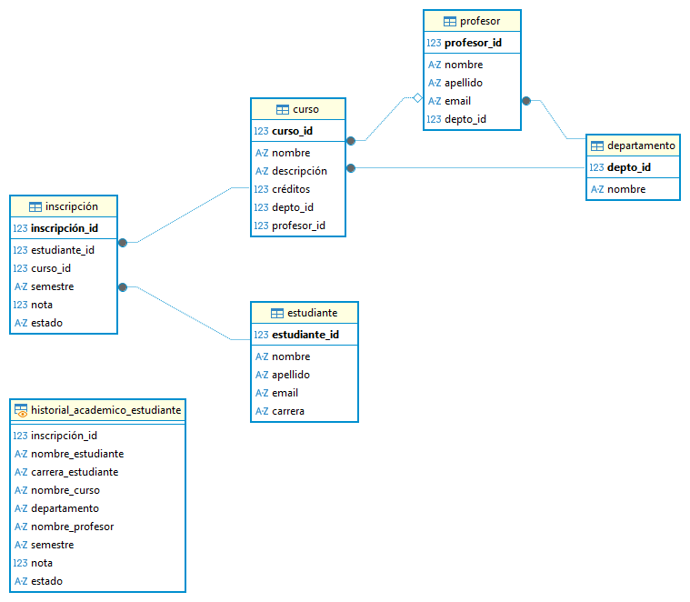
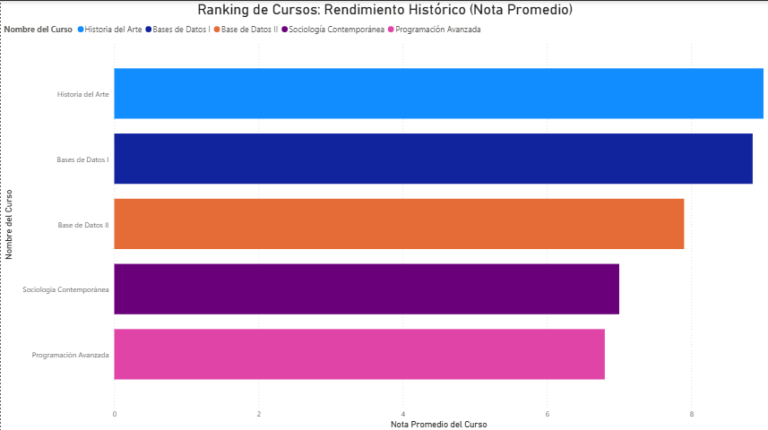

# 8 Proyectos de Modelado de Bases de Datos con PostgreSQL

## Resumen del Repositorio

Esta es una colección de **8 proyectos integrales** de bases de datos diseñados en **PostgreSQL**, que demuestran la capacidad de pasar del modelado de datos simple (1:N) a los esquemas complejos (N:M) orientados al **Análisis de Negocio (BI)**.

Cada proyecto incluye el **DDL**, el **DML**, las **Consultas Analíticas Clave** y el `README.md` de documentación, simulando entornos de negocio reales.

## Progresión de Habilidades y Niveles

Los proyectos están categorizados para mostrar una clara **progresión de aprendizaje** en diseño de esquemas y complejidad SQL:

### Nivel Básico: Fundamentos y Relaciones 1:N

| Proyectos | Enfoque |
| :--- | :--- |
| **P. N°1 - Cuerpos Celestes** | Primer contacto con `CREATE TABLE` y `JOINs`. |
| **P. N°2 - Alquiler de Scooters** | Ciclo Transaccional, uso de `COUNT BY` y `HAVING`. |
| **P. N°3 - Planificador de Citas** | Modelado de restricciones de tiempo y uso de `CHECK`. |

### Nivel Intermedio: Tablas N:M y Lógica de Negocio

| Proyectos | Enfoque |
| :--- | :--- |
| **P. N°4 - Agencia de Viajes** | Manejo de **lógica de fechas** y reservas. |
| **P. N°5 - Copa del Mundo** | **Relaciones N:M complejas** y agregaciones condicionales (`CASE WHEN`). |
| **P. N°6 - Plataforma de E-Commerce** | Modelo de **Transacciones/Facturación**. |

### Nivel Avanzado: Análisis de Datos (BI) y Alto Rendimiento

| Proyectos | Enfoque Técnico |
| :--- | :--- |
| **P. N°7 - Gestión Académica** | Esquema de **Gestión Académica** con cálculos de rendimiento (`AVG` con `GROUP BY`). |
| **P. N°8 - Sistema de Recomendación de Contenido** | Modelo para **Sistema de Recomendación** (Afinidad y Popularidad), clave para el análisis en Power BI. |

---
## Visualizaciones de Ejemplo

Para ejemplificar nuestro portafolio, mostraremos aquí dos gráficos pertenecientes al Proyecto N°7 (Gestión Académica). El primero es el diagrama realizado con **DBeaver**, mientras que el segundo es un gráfico de barras realizado con **Power BI**.



Como puede verse en el Diagrama realizado en **DBeaver**, este esquema relacional utiliza una tabla de enlace central (`Inscripción`) que conecta la entidad `Estudiante` con la entidad `Curso`. Esta tabla de enlace almacena las calificaciones y el estado final, lo cual es la clave para todos los análisis de rendimiento.



Aquí tenemos un gráfico de barras realizado en **Power BI**, titulado **Ranking de Cursos: Rendimiento Histórico (Nota Promedio)**. Para realizarlo, se tomaron la *Nota Promedio del Curso* (Eje X), el *Nombre del Curso* (Eje Y), y como leyenda también se utilizó el *Nombre del Curso*, para añadirle contexto y formato al gráfico.

---

## Cómo Usar Este Repositorio

Si deseas ejecutar cualquiera de los proyectos, sigue estos pasos:

1.  **Clonar el Repositorio:**
    ```bash
    git clone https://github.com/ciroduro01/Base_de_Datos_PostgreSQL.git
    ```

2.  **Configuración de la Base de Datos:**
    * Asegúrate de tener un servidor **PostgreSQL** corriendo localmente.
    * Ejecuta el archivo SQL principal (`Proyecto N°X - Base de Datos... .sql`) de la carpeta deseada en tu cliente SQL (DBeaver, pgAdmin, etc.).

3.  **Explora las Consultas:**
    * Cada carpeta contiene un archivo `Consultas_Clave_ProyectoX.sql` con el código analítico de valor de negocio para ser conectado a herramientas de Business Intelligence.

---

## Licencia

Este trabajo se comparte bajo la **[Licencia MIT](LICENSE)**, lo que permite su uso y modificación con fines de estudio o portafolio, **siempre y cuando se cite al autor original**.

---

# 8 Database Modeling Projects with PostgreSQL

## Repository Overview

This is a collection of **8 comprehensive database projects** designed in **PostgreSQL**, demonstrating the ability to progress from simple (1:N) data modeling to complex (N:M) schemas geared towards **Business Analysis (BI)**.

Each project includes **DDL**, **DML**, **Key Analytical Queries**, and `README.md` documentation, simulating real-world business environments.

## Skills Progression and Levels

The projects are categorized to show a clear **learning progression** in schema design and SQL complexity:

### Basic Level: Fundamentals and 1:N Relationships

| Projects | Focus |
| :--- | :--- |
| **P. 1 - Celestial Bodies** | First contact with `CREATE TABLE` and `JOINs`. |
| **P. 2 - Scooter Rental** | Transaction Model, use of `COUNT BY` and `HAVING` |
| **P. 3 - Appointment Scheduler** | Modeling time constraints and using `CHECK`. |

### Intermediate Level: N:M Tables and Business Logic

| Projects | Focus |
| :--- | :--- |
| **P. 4 - Travel Agency** | Date and Reservation Logic Management. |
| **P. 5 - World Cup** | **Complex N:M Relationships** and Conditional Aggregations (`CASE WHEN`). |
| **P. 6 - E-Commerce Platform** | Transaction/Billing Model. |

### Advanced Level: Data Analysis (BI) and High Performance

| Projects | Focus |
| :--- | :--- |
| **P. 7 - Academic Management Scheme** | Performance Calculations (`AVG` with `GROUP BY`). |
| **P. 8 - Recommendation System Model** | Affinity and Popularity, key for analysis in Power BI. |

---

## How to Use This Repository

If you want to run any of the projects, follow these steps:

1. **Clone the Repository:**
    ```bash
    git clone https://github.com/ciroduro01/Base_de_Datos_PostgreSQL.git
    ```

2. **Database Setup**:
* Make sure you have a PostgreSQL server running locally.
* Run the main SQL file (`Proyecto N°X - Base de Datos... .sql`) from the desired folder in your SQL client (DBeaver, pgAdmin, etc.).

3. **Explore the Queries**:

* Each folder contains a file, `Consultas_Clave_ProyectoX.sql`, with the business-value analytical code to be connected to Business Intelligence tools.

---

## License
This work is shared under the MIT License, which permits its use and modification for study or portfolio purposes, provided that the original author is cited.
